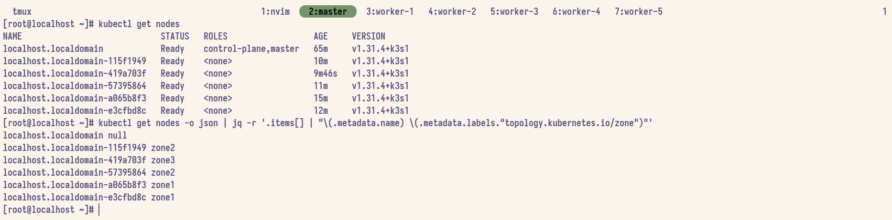

# Тестовое задание от Mindbox

## Условие тестового задания

> [!IMPORTANT]
> Код должен открыться в браузере, без архивов, идеально если в GitHub.

Не ожидаем production-ready решения. Сделайте, как кажется правильным, опишите процесс поиска и принятые решения.

Опишите решение для веб-приложения в kubernetes в виде yaml-манифеста. Оставляйте в коде комментарии по принятым решениям. Есть следующие вводные:

у нас мультизональный кластер (три зоны), в котором пять нод
приложение требует около 5-10 секунд для инициализации
по результатам нагрузочного теста известно, что 4 пода справляются с пиковой нагрузкой
на первые запросы приложению требуется значительно больше ресурсов CPU, в дальнейшем потребление ровное в районе 0.1 CPU. По памяти всегда “ровно” в районе 128M memory
приложение имеет дневной цикл по нагрузке – ночью запросов на порядки меньше, пик – днём
хотим максимально отказоустойчивый deployment
хотим минимального потребления ресурсов от этого deployment’а.

## Выполненные задачи

- [X] Сделать кластер из трех зон и пяти нод
- [ ] 5-10 секунд на инициализацию
- [ ] 4 поды полы под нагрузкой
- [ ] Менеджмент CPU
- [ ] Постоянный RAM
- [ ] Цикл день/ночь (предположительно через cron)
- [ ] Отказоустойчивый deployment
- [ ] Минимальное потребление ресурсов

## Справка

> [!INFO]
> Эти заметки по большей части я сделал для себя. Чтобы не бегать постоянно из редактора в админку Proxmox.
> Также чтобы убедиться что деплой отрабатывает правильно был поднят кластер на k3s.

Для выполнения тестового задания на сервере с Proxmox было создано:

- 1 мастер узел
- 5 рабочих узлов(2 в zone-1, 2 в zone-2, 1 в zone-3)

Все узлы были созданы на основе [k3s](https://k3s.io/).

IP-адреса узлов в локальной сети:

- Master: 192.168.0.81
- Worker-1: 192.168.0.61  
- Worker-2: 192.168.0.46
- Worker-3: 192.168.0.48
- Worker-4: 192.168.0.64
- Worker-5: 192.168.0.5

## Разворачивание k3s кластера из 6 узлов

> [!IMPORTANT]
> Крайне важно на всех узлах перед установкой k3s настроить firewalld.

Для мастер-узла:

```sh
firewall-cmd --permanent --add-port=6443/tcp #apiserver
firewall-cmd --permanent --zone=trusted --add-source=10.42.0.0/16 #pods
firewall-cmd --permanent --zone=trusted --add-source=10.43.0.0/16 #services
firewall-cmd --reload
```

Для рабочих-узлов:

```sh
firewall-cmd --permanent --zone=trusted --add-source=10.42.0.0/16 #pods
firewall-cmd --permanent --zone=trusted --add-source=10.43.0.0/16 #services
firewall-cmd --reload
```

### Установка k3s на master-узел

```sh
curl -sfL https://get.k3s.io | sh -
```

Проверяем работоспособность после установки.

```sh
k3s kubectl get nodes
# Примерный вывод
# NAME                    STATUS   ROLES                  AGE   VERSION
# localhost.localdomain   Ready    control-plane,master   31s   v1.31.4+k3s1
```

### Установка k3s на worker-узлы

Перед установкой k3s надо получить токен с master-узла.

```sh
cat /var/lib/rancher/k3s/server/node-token
# Примерный вывод
# K10362873f74199eb94b1a387ba6ba177e26bca67b4670987c8eb52450eccdd88ac::server:cf519b2af9327ab87fb6603ac3574ac4
```

```sh
curl -sfL https://get.k3s.io | K3S_URL=https://192.168.0.81:6443 K3S_TOKEN=<token> sh -s - --node-label topology.kubernetes.io/zone=<zone> --with-node-id
```

В случае с worker узлами требуется:

1. Указать ссылку на master-узел.
2. Указать токен, который можно получить на master-узле.
3. Через свойство `topology.kubernetes.io/zone` указать явно зону указать явно зону. 
4. Задается уникальной имя рабочему узлу.

Ниже можно увидеть что кластер из 6 нод был успешно создан и у рабочих узлов есть распределение по трем зонам.



## Пояснения к тому или иному решению

## Структура проекта

**k3s** - основная директория.
  - **deployment.yaml** - основной deployment.
  - **hpa.yaml** - HorizontalPodAutoscaler.
  - **cronjobs** - задачи для cron.
    - **day-scaler.yaml** - то как должно работать утром.
    - **night-scaler.yaml** - то как должно работать вечером.
